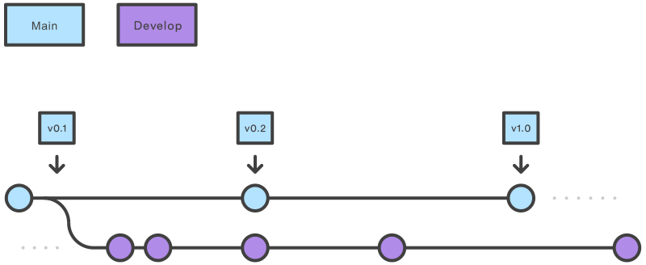
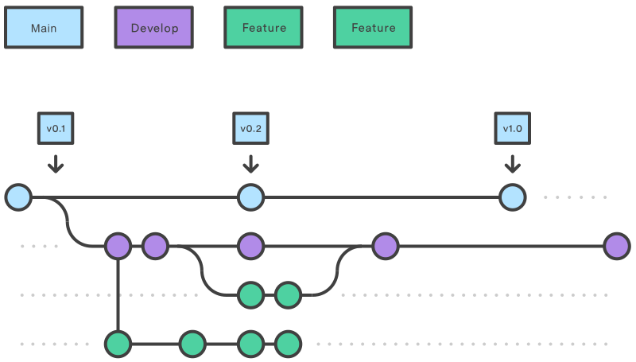
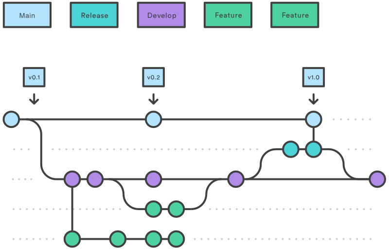
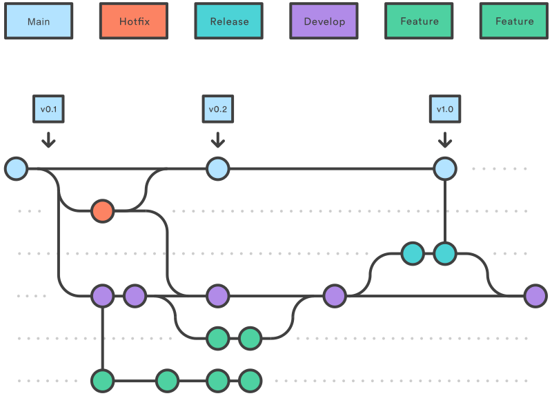

# Gitflow
Gitflow là quy trình làm việc trên git tập trung vào các bản release của dự án. Quy trình này sẽ định nghĩa branch nào được tạo, những branch nào nên merge với nhau, khi nào merge...



## Branch main(master) và branch develop
- **main**: là branch ở vị trí cao nhất của dự án, chứa toàn bộ source của bản release mới nhất.
- **develop**: là branch được tách ra từ branch main, branch này sẽ chứa quá trình làm việc cho tới hiện tại của dự án.

## Branch feature


Các branch feature sẽ được đặt tên theo cú pháp: feature/[tên feature].

Mỗi feature khi thực hiện sẽ được tách ra thành 1 branch và được tách ra từ branch develop. Branch feature không được phép tương tác trực tiếp với branch **main**.

Cách tạo một branch **feature**:
```code
git checkout develop
git checkout -b feature/[tên feature]
```

Sau khi một feature hoàn tất, branch **feature** sẽ được developer yêu cầu merge vào branch **develop**. Việc đồng ý hay từ chối merge request này sẽ do lead quyết định.

## Branch release

Sau khi branch **develop** đã có đủ các tính năng cần thiết để release ra 1 phiên bản, branch release/[tên phiên bản] sẽ được tách ra từ branch **develop**. Lead sẽ sửa đổi trên branch này để chuẩn bị cho bản release [tên phiên bản]. Sau khi hoàn tất, branch **release** sẽ được merge vào branch **main** và branch **develop**.

Tách branch **release** ra như trên sẽ giúp cho 1 bộ phận team có thể sửa đổi cho phù hợp với release trong khi bộ phận còn lại của team vẫn có thể tiếp tục xây dựng các tính năng.

Cách tạo một branch **release**:
```code
git checkout develop
git checkout -b release/[tên version]
```

## Branch hotfix

Trong trường hợp những thay đổi đã được push lên branch **main** nhưng sau khi sử dụng thì vẫn xảy ra một số lỗi chưa được phát hiện và cần sửa gấp, branch **hotfix** sẽ được tách ra từ branch **main**. Tách ra branch như thế này sẽ giúp cho team tiếp cận với vấn đề gấp mà không làm gián đoạn quá trình phát triển của team và cũng không phải chờ tới bản release sau để fix những lỗi gấp này.

Cách tạo branch **hotfix**:
```code
git checkout main
git checkout -b hotfix/[tên lỗi]
```

Sau khi branch **hotfix** đã hoàn tất, ta merge lại vào main bằng cách:
```code
git checkout main
git merge hotfix/[tên lỗi]
git checkout develop
git merge hotfix/[tên lỗi]
git branch -D hotfix/[tên lỗi]
```

## Tổng kết
Workflow này nhằm hỗ trợ cho việc phát triển phần mềm tập trung vào các bản release

Flow chung của Gitflow sẽ như sau:
1. Branch **develop** sẽ được tạo từ branch **main**
2. Các branch **release** sẽ được tạo từ branch **develop**
3. Các branch **feature** sẽ được tạo từ branch **develop**
4. Khi một branch **feature** được hoàn tất, branch này sẽ được merge vào branch **develop** bằng merge request
5. Khi branch **release* hoàn tất, branch này sẽ được merge vào branch **develop** và **main**
6. Khi một vấn đề xảy ra ở branch **main**, branch **hotfix** sẽ được tạo ra để sửa gấp
7. Khi branch **hotfix** hoàn tất, branch này sẽ được merge vào branch **develop** và **main**


# Conventional commit
Conventional commit là quy tắc commit để có thể dễ kiểm soát lịch sử các commit, giúp cho các tool tự động hóa có thể dễ hoạt động. 

Message commit của conventional commit sẽ có cấu trúc như sau:

```code
<type>[optional scope]: <description>

[optional body]
```

Ví dụ:
```code
fix: prevent racing of requests

Introduce a request id and a reference to latest request. Dismiss
incoming responses other than from latest request.

Remove timeouts which were used to mitigate the racing issue but are
obsolete now.
```

## type
type thể hiện những thay đổi trong commit này thuộc loại nào. Các type thường được sử dụng:
1. **feat**: Được sử dụng khi thêm 1 tính năng mới
2. **fix**: Được sử dụng khi sửa 1 bug
3. **docs**: Được sử dụng khi thay đổi document của dự án
4. **style**: Được sử dụng khi thay đổi code nhưng không làm ảnh hưởng tới ý nghĩa code (thêm khoảng cách, chấm phẩy, format lại dòng...)
5. **refactor**: Được sử dụng khi thay đổi code nhưng không fix bug cũng không thêm feature, chỉ tổ chức lại code
6. **perf**: Được sử dụng khi thay đổi code để tăng hiệu năng, không sinh ra thêm tính năng
7. **test**: Được sử dụng khi thêm hoặc sửa test (unit test, integration test...)
8. **build**: Được sử dụng khi thay đổi hệ thống build hoặc các dependency bên ngoài (như npm)
9. **ci**: Được sử dụng khi thay đổi các config liên quan tới CI/CD
10. **chore**: Được sử dụng khi không thay đổi bất kì source hay test file nào
11. **revert**: Được sử dụng để revert lại một commit

## scope
Scope không bắt buộc phải có, scope thể hiện các thay đổi này sẽ được thực hiện cho "vùng" nào của dự án
Ví dụ:
```code
feat(api): send an email to the customer when a product is shipped
```

## description
Mô tả sơ lược về các thay đổi có trong commit.

Các chi tiết hơn của sự thay đổi có thể được đưa vào body (không bắt buộc)
Ví dụ:
```code
fix: add missing parameter to service call

The error occurred because of <reasons>.
```
## Breaking changes
Đối với các thay đổi mang tính breaking (làm cho các bản cũ không thể sử dụng được, làm cho các phần code khác của team có thể sẽ phải thay đổi...), commit cần phải thêm dấu **!** vào trước dấu **:**.

Các thay đổi breaking cần được mô tả trong body và bắt đầu bằng BREAKING CHANGE
Ví dụ:
```code
feat: allow provided config object to extend other configs

BREAKING CHANGE: `extends` key in config file is now used for extending other config files
```

## Các ví dụ của conventional commit:
```code
feat(shopping cart): add the amazing button
```
```code
feat: remove ticket list endpoint

BREAKING CHANGES: ticket enpoints no longer supports list all entites.
```
```code
fix: add missing parameter to service call

The error occurred because of <reasons>.
```
```code
build(release): bump version to 1.0.0
```
```code
build: update dependencies
```
```code
refactor: implement calculation method as recursion
```
```code
style: remove empty line
```
